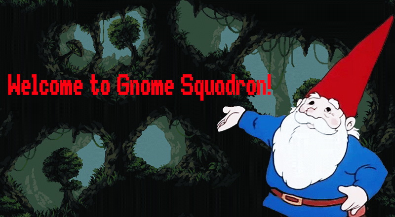

# GnomeSquadron

## Background
As a fun mini game for my previous Arium project I created this side scrolling shooter about a gnome who goes into a well that is more of a giant cavern in order to fight evil spirits and cleanse the well of evil.   The graphics and sound pay homage to multiple of my favorite games from my youth including Secret Of Mana Final Fatansy 6 and Mega Man X.

## Functionality & MVP
Users will be able to:
* Fly around the skin and shoot evil spirits.
* They will be able to acquire a power up and fight both a mini boss and a final boss.
* Loss of 3 lives will prompt a continue screen which resets the game.

## Wireframe
The game has a splash page with insutrctions, a mute button and a brief animated description of the games plot that I made by hand.

## Architecture & Technologies
Gnome Squadron is made using the following technologies:
* `HTML/CSS` for rendering the mute button and the animated intro.
* `Javascript and Canvas` to write all of the code that goes into the game itself

## Implementation Timeline
* Day 1: 
    * Find background and enemy and main character graphics 
    * Write hit detection and projectiles 
    * Implement rendering and movements of the essential elements.
* Day 2:
    * Design the `HTML/CSS` elements for the mute button
    * Find sound effects and music and edit these noises so that are heard at the correct times
* Day 3:
    * Choreograph a boss fight 
    * Implement a reset feature that correct resets multiple elements in the game so that the game can be played through again.
* Day 4:
    * Play test and look for bugs
    * Fix up graphics and sound and adjust setting to allow for a 2 minute maximum play though for presentation.

## Bonus Features

* Randomized enemy movements and attacks
* Power ups that change weapon functionality and visual appearance.
* A final victory screen to give a sense of closure to the game.
